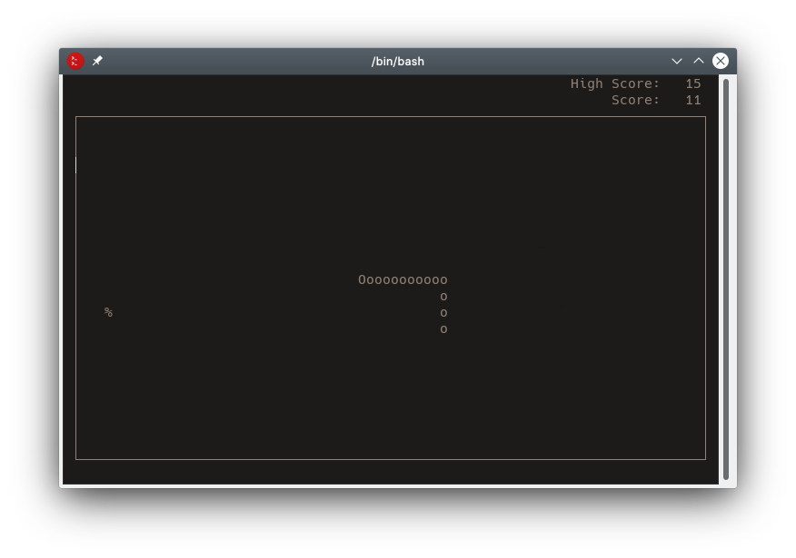

# Snake

A game of snake written in C++ using ncurses.

## Requirements

* gcc
* ncurses

## Installation

	make
	./snake
	
## Controls
	
Turn left:

	a or leftarrow
	
Turn right:

	d or rightarrow
	
Quit:

	q or ESC 
	
## License

This project is licensed under the GPLv3 License - see the [LICENSE](LICENSE.txt) file for details.

## Acknowledgments

Thanks to OneLoneCoder for the inspiration.
